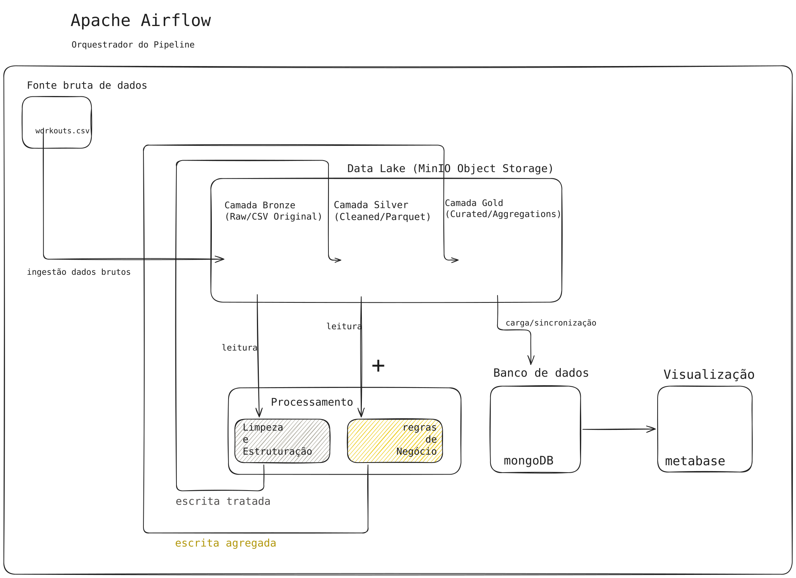

# Pipeline de Exploração de Dados (Treinos).

Este projeto implementa uma arquitetura de microserviços orientada a dados para extração, transformação e carga (ETL), utilizando as principais ferramentas do ecossistema de Big Data.

---
# Fase atual/proximo passo:
- Criar container para o **MinIO**; ✅
- criar arquitetura de dados **MongoDB** - *Em Andamento*; 
- tratar dados para o **datalake Silver** - *Em Andamento*;
- tratar dados para o **datalake Gold**;
- criar gráficos no **MetaBase**;

# Sumário

* [1. Arquitetura do Projeto](##arquitetura-do-projeto)
* [2. Ligando o ambiente](##passo-a-passo-para-ligar-o-ambiente)
* [3. Desligando o ambiente](##como-desligar-o-ambiente)
* [4. Diagrama](#diagrama-do-pipeline)
* [5. Modelagem dados] (##modelagem-dados-mongodb)


## Aquitetura do Projeto
A infraestrutura está dividida em 4 pilares isolados, conectados por uma rede virtual externa (`treino_bigdata`):
1. **MinIO** Object storage, Data Lake oficial do projeto.
2. **MongoDB:** Banco de Dados NoSQL e Interface (Mongo Express).
3. **Metabase:** Ferramenta de Business Intelligence para Dashboards.
4. **Apache Spark / Jupyter:** Ambiente de processamento distribuído e prototipagem.
5. **Apache Airflow:** Orquestrador de pipelines e automação de tarefas.
6. **MinIO:** Object storage para organização de nivel de tratamento dos dados.
---

## Passo a Passo para Ligar o Ambiente

Abra o terminal na raiz do projeto (`/opt/exploracao_dados_treino`) e siga a ordem de ignição abaixo:

### Passo 0: A Rede Virtual (Apenas na primeira vez)
Se for a primeira vez rodando o projeto nesta máquina, crie a rede que conecta todos os contêineres:
```bash
docker network create --driver bridge treino_bigdata
```
---
### Passo1: Ligar o Data Lake (MinIO)
```bash
cd minio
docker compose up -d
```
### Passo2: Ligar o Banco de Dados (MongoDB)
```bash
cd mongodb
docker compose up -d
```
- Mongo Express: http://localhost:8081 (Usuário: admin | Senha: pass)

### Passo 3:Ligar a Camada de Visualização (Metabase)
```bash
cd ../metabase
docker compose up -d
```
- Metabase: http://localhost:3000 (Aguarde ~3 min na primeira inicialização)

### Passo 4:Ligar o Motor de Processamento (Spark/Jupyter)
```bash
cd ../spark
docker compose up -d
```
- Para acessar o Jupyter: Rode docker compose logs | grep 'token=' para pegar o link de acesso.
- Jupyter Notebook: Porta 8889
- Spark UI: http://localhost:4040 (Ficará ativa apenas quando uma sessão PySpark for iniciada no notebook)

### Passo 5: Ligar o Orquestrador (Airflow)
A inicialização do Airflow requer a configuração de chaves de segurança e permissões de pastas.

```bash
cd ../airflow
./pre-setup.sh
./post-setup.sh
```
(Aguarde o término das barras de progresso de cada script)
- Apache Airflow: http://localhost:8080 (Usuário: admin | Senha: admin)

---

## Como Desligar o Ambiente

Para desligar todos os serviços sem perder nenhum dado (os volumes garantem a persistência), execute o comando docker compose down dentro de cada respectiva pasta:

```bash
cd /opt/exploracao_dados_treino/airflow && docker compose stop
cd ../spark && docker compose stop
cd ../metabase && docker compose stop
cd ../mongodb && docker compose stop
cd ../minio && docker compose stop
```
---
# Diagrama do Pipeline


---
# Modelagem dados MongoDB

```json
{
  "id_": "objact_id()",
  "start_time": "00 00 0000 00:00",
  "end_time": "00 00 0000 00:00",
  "title": "treino X",
  "exercicios_title": {
    "remada": {
        "serie":{

           "carga": "20kg",
      },
    },
  },
  "tags": ["exemplo", "documentacao", "markdown"]
}
```
